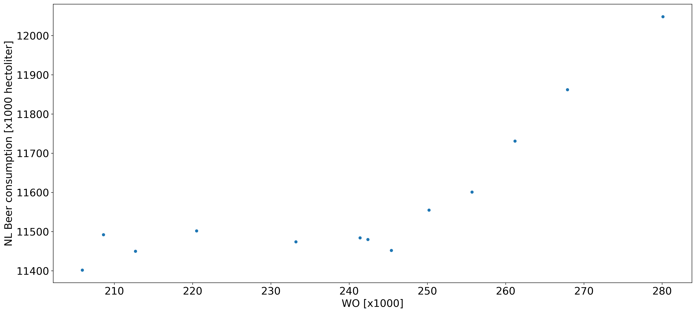

# Seminar CLS L2: Tools for Computational Scientists

Author: Warwick Louw

## Pivotal Papers
Some pivotal papers include:

 * Fantastic Yeasts And Where To Find Them: The Hidden Diversity Of Dimorphic Fungal Pathogens by MCC Van Dyke et al.
 * An Analysis Of The Forces Required To Drag Sheep Over Various Surfaces by JT Harvey et al.
 * Correlation Of ContinuousCardiac Output Measured By A Pulmonary Artery Catheter Versus Impedance Cardiography In Ventilated Patients by Daniel W. Ziegler et al. 

## Now a graph that begs the question: is there correlation?

